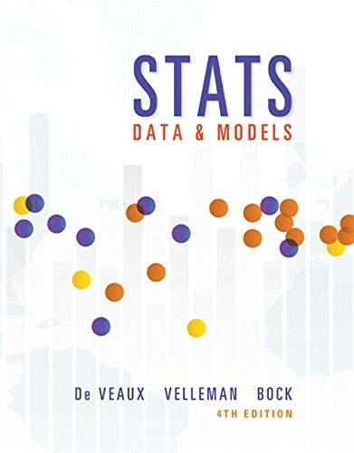

These documents are intended to help describe how to undertake analyses introduced 
as examples in the **_Fourth Edition of Stats: Data and Models (2014)_** by De Veaux, Velleman, and Bock.
More information about the book can be found [here](http://wps.aw.com/aw_deveaux_stats_series).

This work leverages initiatives undertaken by [Project MOSAIC](http://www.mosaic-web.org), an NSF-funded effort to improve the teaching of statistics, calculus, science and computing in the undergraduate curriculum. For more information about the 'mosaic' package, visit the About tab. 

Resources related to the mosaic package can be found under the 'Other Resources' tab. 

